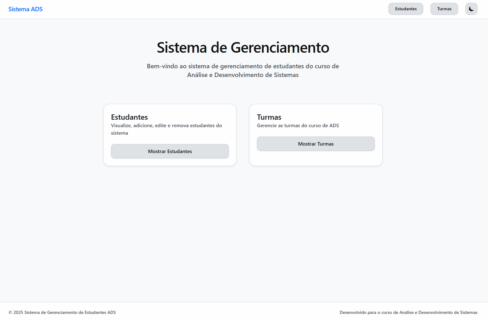

# Projeto Laravel

Este é um projeto Laravel configurado para usar PostgreSQL como banco de dados e Tailwind CSS para estilização.

## Pré-requisitos

- PHP 7.x ou superior
- Composer
- PostgreSQL
- Extensão PHP para PostgreSQL (`php-pgsql`)
- Node.js e npm (para Tailwind CSS)

## Configuração do Ambiente

1. Clone o repositório:

   ```bash
   git clone <URL_DO_REPOSITORIO>
   cd app-ads
   ```

2. Copie o arquivo `.env.example` para `.env` e configure suas variáveis de ambiente. Certifique-se de que as configurações do banco de dados estão corretas:

   ```plaintext
   DB_CONNECTION=pgsql
   DB_HOST=127.0.0.1
   DB_PORT=5432
   DB_DATABASE=postgres
   DB_USERNAME=postgres
   DB_PASSWORD=postgres
   ```

3. Gere a chave da aplicação:

   ```bash
   php artisan key:generate
   ```

## Instalação

1. Instale as dependências do projeto usando o Composer:

   ```bash
   composer install
   ```

2. Instale as dependências do Node.js para Tailwind CSS:

   ```bash
   npm install
   ```

3. Execute as migrações do banco de dados:

   ```bash
   php artisan migrate
   ```

## Executando o Projeto

1. Compile os assets do Tailwind CSS:

   ```bash
   npm run dev
   ```

2. Inicie o servidor de desenvolvimento:

   ```bash
   php artisan serve
   ```

3. Acesse o projeto em seu navegador em `http://localhost:8000`.

## Testes

Para rodar os testes, execute:

```bash
php artisan test
```

## Contribuição

Se você deseja contribuir com este projeto, por favor, faça um fork do repositório e envie um pull request.

```
